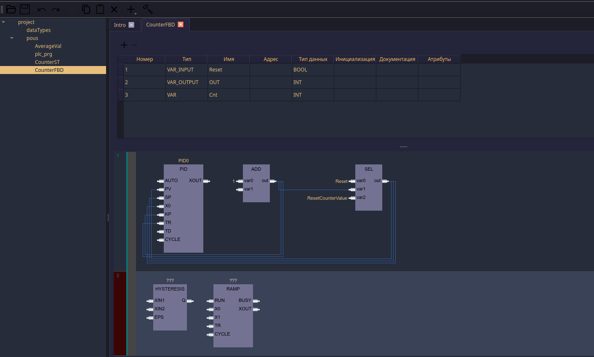
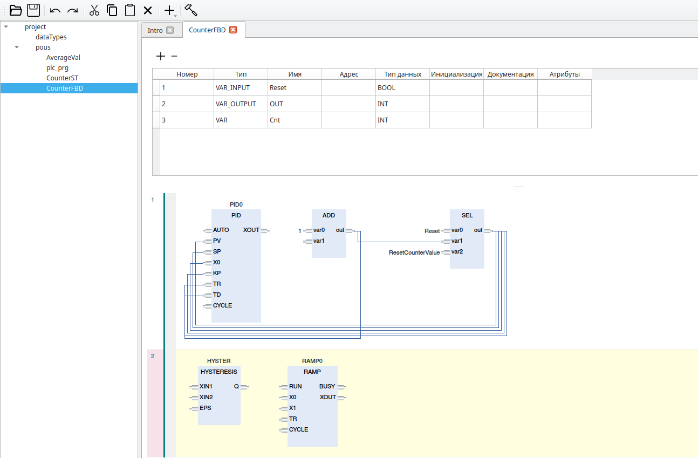

# FBD (later LD) editor

## Интеграция в программу

FBD диаграмма это виджет. `fbd/graphics/cdiagramwidget.h`

```c++
CDiagramWidget(const QDomNode &pou_node, CTreeObject * tree_object,
                            const bool &is_editable = true, QWidget *parent = nullptr);
```
### входные параметры
`const QDomNode &pou_node`    обязательно непустая QDomNode, а часть проектной QDomNode, даже если pou - новая, 
должны быть (даже пустые) следующие теги:

``` xml
<pou name="pouName" pouType="functionBlock">
    <interface>
    </inetrface>
    <body>
        <FBD>
        </FBD>
    <body>
</pou>
```

`CTreeObject * tree_object` - дерево компонентов, в котором диаграмма отображает соответствующие компоненты<br>
`const bool &is_editable`   - редактируемая или нет диаграмма.<br>
`QWidget *parent`           - родитель виджета диаграммы.


### Сигналы и свойства диаграммы

```c++
    QUndoStack *    undo_stack(); //!< механизм undo/redo для реакции на нажатия хот-кей и кнопок с меню
    
signals:
    void    changed_diagram(const QDomNode & node); //!< diagram was changed    
    void    undo_enabled();                         //!< на диаграмме выполнены какие-то действия и механизм undo/redo готов к работе
    /** @brief на диаграмме появился новый блок (не функция) и теперь необходимо добавить в интерфейс (локальные 
     * переменные) новую переменную с обозначенным типом и именем*/
    void    interface_variable_new(const QString &type, const QString &name);
    
    /** @brief если юзер переименовал блок, то вот вам данные для переименования в интерфейсе */
    void    interface_variable_rename(const QString &old_name, const QString &new_name);
    /** @brief если пользователь удалил блок, то вот вам данные для удаления соответствующей переменной.*/
    void    instance_removed(const QString &type, const QString &name);
public slots:
    /** @brief пользователь ввёл новую переменную. Внутреннее представление обновит данные о локальном интерфейсе */
    void   update_interface();  
```

## Краткое описание
Диаграмма поддерживает светлую и тёмную темы:



пока инструкция (ниже), позже тут будет актуальная инфа.<br>
[Инструкция](man/instruction.docx)

### Диаграмма не поддерживает (в этом выпуске):
- масштаб (сейчас колесо мыши и \<ctrl> работает как вертикальный/горизонтальный скроллинг) (скорее всего нужно)
- указатели (т.е. на вход типа INT записать разыменованный указатель) и элементы массивов на входы/выходы (нужно)
- множественный выбор (смысла в нём немного, если вообще есть).

### Мысли на будущее
- при клике на вход/выход выделять присоединённые блоки и пины, а на узком "поле" справа в масштабе 
  показывать местонахождение выделенных объектов.